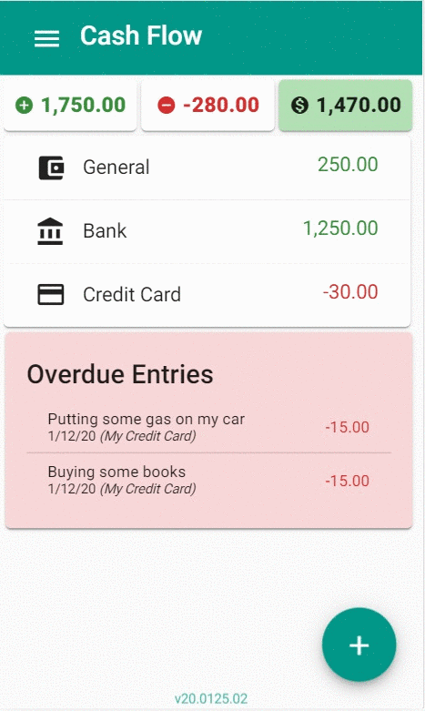
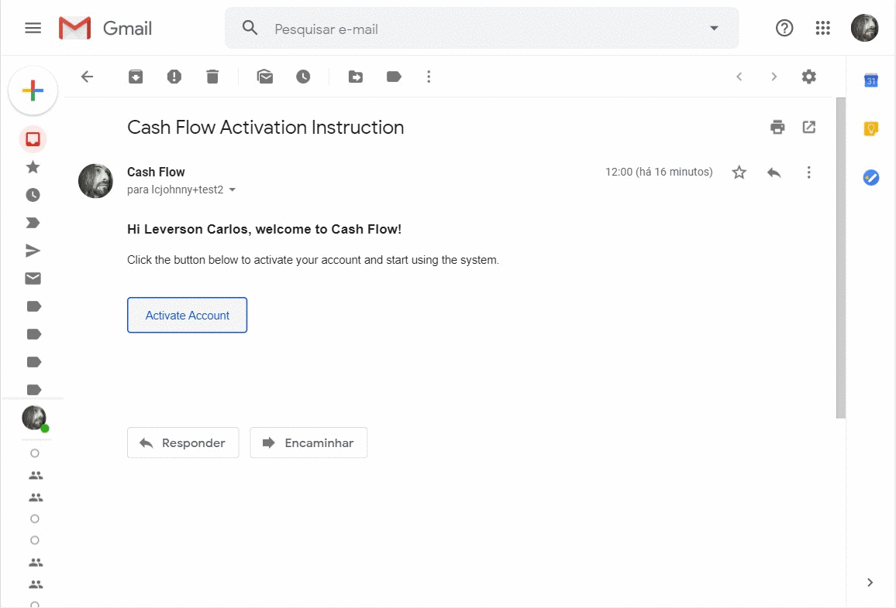
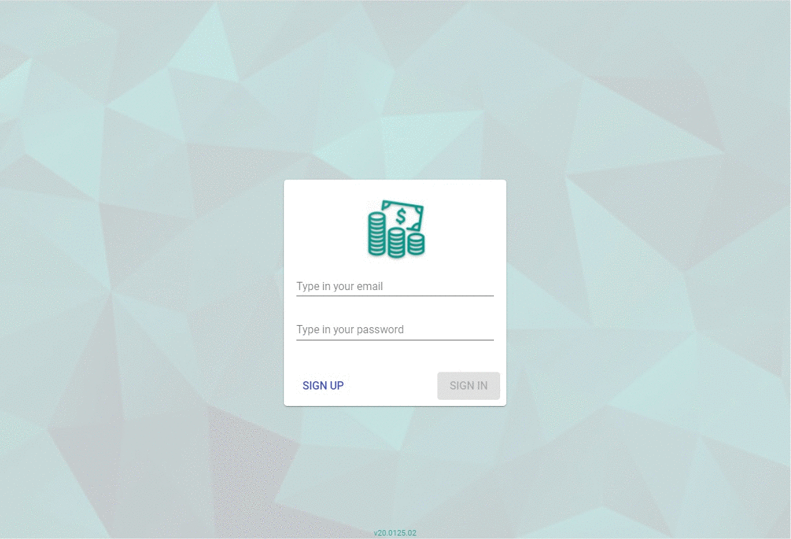
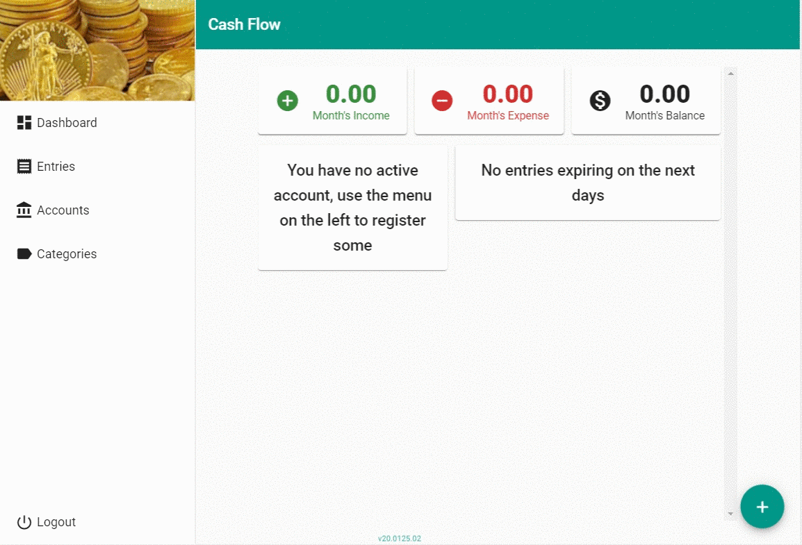
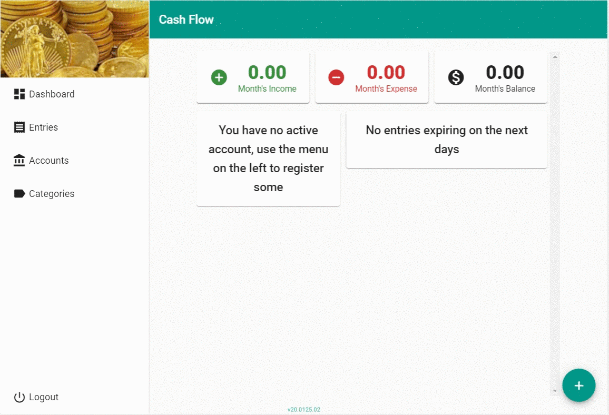
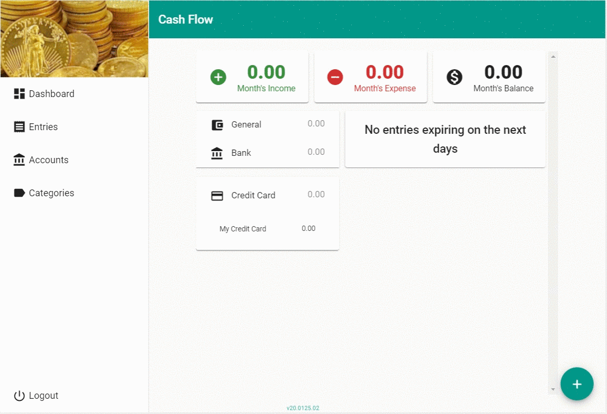
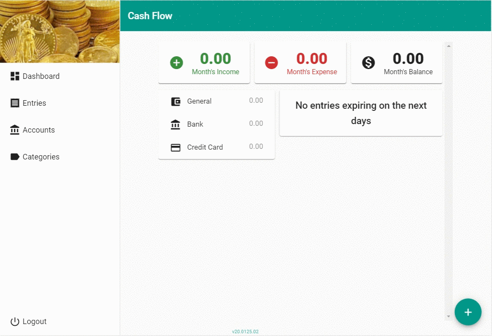
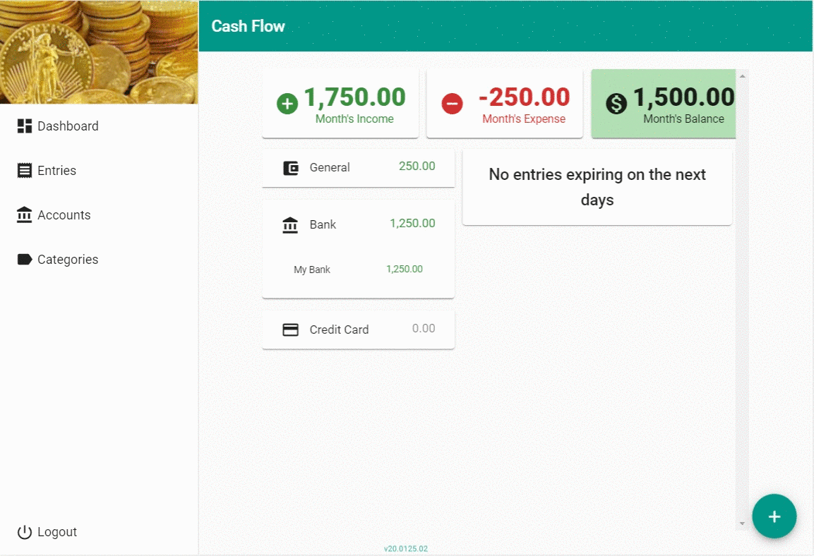

# Friendly Cash Flow


A straightforward cash flow web application. Set your accounts and categories and then register your incomes and expenses. You will be able follow the flow of your cash through the months, see where it goes and where you could save.

## History goes like this

<a href="./resources/demo/10-mobile.gif">
   
</a>

This is my **particular** cash flow system. I'm always trying some of the market's application for cash flow. And, as a developer, i always come back to my own implementation.

This is the one app that give me exactly what i want from this kind of application. And if there something missing or broken, i can fix it. Besides that, i'm always using this project as my personal case for **study, learning and practicing** new technologies. 

My endeavour started back on early 2000 with `vb6`, passed through `vb.net` and then `c#`. Started as a desktop app, turned into web site (with `aspnet`) and now a progressive web application (with `aspnet core` and `angular`).

Ever since, my sources were on cloud drivers and **private repositories**. This time i thought will be cool to **open the sources** on a public repository and, who knows, maybe somebody like-it, maybe somebody fix that anoying bug, or even somebody enhance something.

So, feel free to clone-it and make-it better.


[](https://docs.microsoft.com/aspnet)
[](https://angular.io)
[](https://material.angular.io) 
[](http://badges.mit-license.org)
<!-- shields.io -->

[](https://dev.azure.com/lcjohnny/Playground/_build/latest?definitionId=11)

## Installation

### Get started
- **Clone this repo** to your local machine using 
   ``` shell 
   git clone https://github.com/LeversonCarlos/FriendlyCashFlow.git
   ```
- Install **client packages** with 
   ``` shell 
   npm install ./srcs/ClientApp
   ```
- **Build** the backend project with 
   ``` shell 
   dotnet build ./srcs
   ```
- Prepare the **database structure** with 
   ``` shell 
   dotnet ef database update --project ./srcs
   ```
- **Run the application** locally with 
   ``` shell
   dotnet run --project ./srcs
   ```

### Customize application settings
There is a file on the **srcs folder** called **appsettings.json**. On this file some behaviours of the application is defined.
- **BaseHost**: Path used to compose urls when the application is hosted somewhere
- **ConnStr**: The connection string used to connect to the database used by the application
- **Passwords**: Section defining the requirements for the passwords set by the users
- **Token**: Section defining the tokens that will be used to authenticate users on his calls to the backend apis
- **Mail**: Section defining the SMTP server used to send mails to the users
- **AppInsights**: Section where an azure's application insights could be set to monitor app usage

## Try it out
I put a test version online that can be accessed [here](https://friendlycashflow-dev.azurewebsites.net/). You can report bugs [here](https://github.com/LeversonCarlos/FriendlyCashFlow/issues).

## Usage

### Register and access the application
<a href="./resources/demo/01-register.gif"></a>
<a href="./resources/demo/02-activate.gif"></a>
<a href="./resources/demo/03-login.gif"></a>

### You cant register entries without domain data
<a href="./resources/demo/04-empty-domains.gif"></a>

### Defining your domain data
<a href="./resources/demo/05-accounts.gif"></a>
<a href="./resources/demo/06-categories.gif"></a>

### Registering some income entries
<a href="./resources/demo/07-income.gif"></a>

### Registering some transfers
<a href="./resources/demo/08-transfer.gif"></a>

### Registering some expense entries
<a href="./resources/demo/09-expenses.gif"></a>


## Built With

* [Aspnet Core](https://docs.microsoft.com/aspnet)
* [Angular](https://angular.io)
* [Material Design](https://material.angular.io)

## Authors

* [Leverson Carlos](https://github.com/LeversonCarlos)
* [other contributors](https://github.com/LeversonCarlos/FriendlyCashFlow/graphs/contributors)

## License

MIT License - see the [LICENSE](LICENSE) file for details
