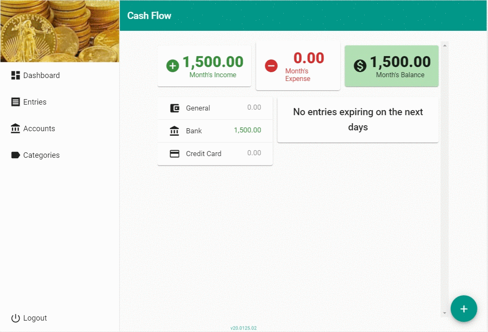

# Friendly Cash Flow


A straightforward cash flow web application. Set your accounts and categories and then register your incomes and expenses. You will be able follow the flow of your cash through the months, see where it goes and where you could save.

## History goes like this

<a href="./resources/demo/10-mobile.gif"></a>

This is my **particular** cash flow system. I'm always trying some of the market's application for cash flow. And, as a developer, i always come back to my own implementation.

This is the one app that give me exactly what i want from this kind of application. And if there something missing or broken, i can fix it. Besides that, i'm always using this project as my personal case for **study, learning and practicing** new technologies. 

My endeavour started back on early 2000 with `vb6`, passed through `vb.net` and then `c#`. Started as a desktop app, turned into web site (with `aspnet`) and now a progressive web application (with `aspnet core` and `angular`).

Ever since, my sources were on cloud drivers and **private repositories**. This time i thought will be cool to **open the sources** on a public repository and, who knows, maybe somebody like-it, maybe somebody fix that anoying bug, or even somebody enhance something.

So, feel free to clone-it and make-it better.


[](https://docs.microsoft.com/aspnet)
[](https://angular.io)
[](https://material.angular.io/) 
[](http://badges.mit-license.org)
<!-- shields.io -->

[](https://dev.azure.com/lcjohnny/Playground/_build/latest?definitionId=11)

## Usage

### Register and access the application
<a href="./resources/demo/01-register.gif"></a>
<a href="./resources/demo/02-activate.gif"></a>
<a href="./resources/demo/03-login.gif"></a>

### You cant register entries without domain data
<a href="./resources/demo/04-empty-domains.gif"></a>

### Defining your domain data
<a href="./resources/demo/05-accounts.gif"></a>
<a href="./resources/demo/06-categories.gif"></a>

### Registering some income entries
<a href="./resources/demo/07-income.gif"></a>

### Registering some transfers
<a href="./resources/demo/08-transfer.gif"></a>

### Registering some expense entries
<a href="./resources/demo/09-expenses.gif"></a>


## Example (Optional)

```javascript
// code away!

let generateProject = project => {
  let code = [];
  for (let js = 0; js < project.length; js++) {
    code.push(js);
  }
};
```

---

## Installation

- All the `code` required to get started
- Images of what it should look like

### Clone

- Clone this repo to your local machine using `https://github.com/fvcproductions/SOMEREPO`

### Setup

- If you want more syntax highlighting, format your code like this:

> update and install this package first

```shell
$ brew update
$ brew install fvcproductions
```

> now install npm and bower packages

```shell
$ npm install
$ bower install
```

- For all the possible languages that support syntax highlithing on GitHub (which is basically all of them), refer <a href="https://github.com/github/linguist/blob/master/lib/linguist/languages.yml" target="_blank">here</a>.

---

## Features
## Usage (Optional)
## Documentation (Optional)
## Tests (Optional)

- Going into more detail on code and technologies used
- I utilized this nifty <a href="https://github.com/adam-p/markdown-here/wiki/Markdown-Cheatsheet" target="_blank">Markdown Cheatsheet</a> for this sample `README`.

---

## Contributing

> To get started...

### Step 1

- **Option 1**
    - 🍴 Fork this repo!

- **Option 2**
    - 👯 Clone this repo to your local machine using `https://github.com/joanaz/HireDot2.git`

### Step 2

- **HACK AWAY!** 🔨🔨🔨

### Step 3

- 🔃 Create a new pull request using <a href="https://github.com/joanaz/HireDot2/compare/" target="_blank">`https://github.com/joanaz/HireDot2/compare/`</a>.

---

## Team

> Or Contributors/People

| <a href="http://fvcproductions.com" target="_blank">**FVCproductions**</a> | <a href="http://fvcproductions.com" target="_blank">**FVCproductions**</a> | <a href="http://fvcproductions.com" target="_blank">**FVCproductions**</a> |
| :---: |:---:| :---:|
| [](http://fvcproductions.com)    | [](http://fvcproductions.com) | [](http://fvcproductions.com)  |
| <a href="http://github.com/fvcproductions" target="_blank">`github.com/fvcproductions`</a> | <a href="http://github.com/fvcproductions" target="_blank">`github.com/fvcproductions`</a> | <a href="http://github.com/fvcproductions" target="_blank">`github.com/fvcproductions`</a> |

- You can just grab their GitHub profile image URL
- You should probably resize their picture using `?s=200` at the end of the image URL.

---

## FAQ

- **How do I do *specifically* so and so?**
    - No problem! Just do this.

---

## Support

Reach out to me at one of the following places!

- Website at <a href="http://fvcproductions.com" target="_blank">`fvcproductions.com`</a>
- Twitter at <a href="http://twitter.com/fvcproductions" target="_blank">`@fvcproductions`</a>
- Insert more social links here.

---

## Donations (Optional)

- You could include a <a href="https://cdn.rawgit.com/gratipay/gratipay-badge/2.3.0/dist/gratipay.png" target="_blank">Gratipay</a> link as well.

[](https://gratipay.com/fvcproductions/)


---

## License

[](http://badges.mit-license.org)

- **[MIT license](http://opensource.org/licenses/mit-license.php)**
- Copyright 2015 © <a href="http://fvcproductions.com" target="_blank">FVCproductions</a>.